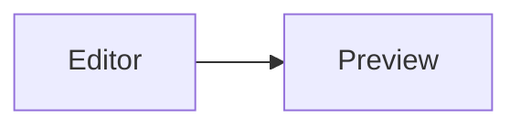

# MD++ Markup Reference

How to write Markdown for **Preview Mode** in this Notepad fork.

Live check: open [`MD++-preview-test.md`](MD++-preview-test.md) with **View → Preview Mode**.  
Feature overview: [`Preview-Mode.md`](Preview-Mode.md).  
Rentry syntax reference: [rentry.org/#how](https://rentry.org/#how).

---

## 1. Basic Markdown (as on Rentry)

| Write | Result |
|-------|--------|
| `# Header 1` … `###### Header 6` | Headings |
| `*italics*` `**bold**` `~~strikeout~~` | Emphasis |
| `==mark==` | Highlight |
| `- item` / `* item` (nest with 4 spaces or 1 tab) | Bulleted list |
| `1. item` | Numbered list |
| `- [ ]` / `- [x]` | Checkboxes |
| `>` / `>>` | Blockquote |
| `***` | Horizontal rule |
| `` `inline code` `` | Inline code |
| `` ``` lang `` … `` ``` `` | Fenced code block |
| `\| Header \|` + `------` row | Tables (`\n` inside a cell = line break) |
| `[description](https://example.com)` | Link (include `http(s)://`) |
| `https://rentry.co/` or `rentry.co` | Autolink |
| `` | Image |
| `\*not italics\*` | Escaped literal |

Return once = new line. Return twice = new paragraph.  
Comments (hidden in preview): `[//]: (comment here)`

---

## 2. Rentry syntax ([rentry.org/#how](https://rentry.org/#how))

### Colored text

```markdown
%red% Colored Text %%
%#ACBDEF% Colored Text Hex %%
```

Named colors (see [rentry text colors](https://rentry.org/rentry-text-colors)). Hex form uses `#` **inside** the percent delimiters: `%#RRGGBB%…%%`.

### Spoilers

```markdown
!>Spoiler text
```

### Alignment

```markdown
-> Centered text <-
-> Right-aligned ->

->  <-

### -> Centered header <-
```

Also works for images. For headers, put the `#` markers **before** `->` (as on Rentry).

### Table of contents

```markdown
[TOC]
[TOC2]
```

`[TOC]` — from `#` through `######`. `[TOC2]` — from `##` through `######`. (`[TOC3]` … `[TOC6]` follow the same pattern.)

### Admonitions

```markdown
!!! note Admonition title
    Admonition text

!!! info
    Title or text can be skipped
```

Main types: `info`, `note`, `warning`, `danger`. Default type if omitted: `warning`. Additional type: `greentext`. Body lines are indented.

### Image size / float (Rentry)

```markdown
{100px:100px}


```

Units for size: `px`, `%`, `vw`, `hw`, or bare pixels. `#left` / `#right` float the image.  
Linked image: `[](https://rentry.co)`

---

## 3. Extra MD++ (beyond Rentry How)

These work in Notepad Preview in addition to the Rentry forms above.

### GitHub-style admonitions

```markdown
> [!NOTE]
> Body

> [!TIP]
> …

> [!IMPORTANT]
> …

> [!WARNING]
> …

> [!CAUTION]
> …
```

### Typography / footnotes

| Write | Result |
|-------|--------|
| `\|\|hidden text\|\|` | Spoiler (same idea as `!>`) |
| `H~2~O` | Subscript |
| `x^2^` | Superscript |

```markdown
Note[^1]

[^1]: Footnote body.
```

### Math and diagrams

```markdown
Inline: $E=mc^2$

Display:
$$
\int_0^1 x^2\,dx
$$
```



### Frontmatter

Optional YAML at the **very start** of the file:

```markdown
---
page:
  title: "My page"
access:
  theme: "auto"
---

# Content starts here
```

### Tabs

```markdown
=== "Tab A"
Content for A.

=== "Tab B"
Content for B.
```

---

## 4. Not implemented (Rentry has it; MD++ Preview does not)

| Feature | Example from Rentry |
|---------|---------------------|
| Underline tags | `!~text~!`, `!~red; text~!` |
| Float clear | `!;` |
| Page metadata | `PAGE_TITLE = …` and other `PAGE_` / `CONTAINER_` / `CONTENT_` options |

---

## Related files

- [`MD++-preview-test.md`](MD++-preview-test.md) — manual regression suite
- [`Preview-Mode.md`](Preview-Mode.md) — Preview Mode UX and troubleshooting
- [`preview/README.md`](../preview/README.md) — offline preview assets
