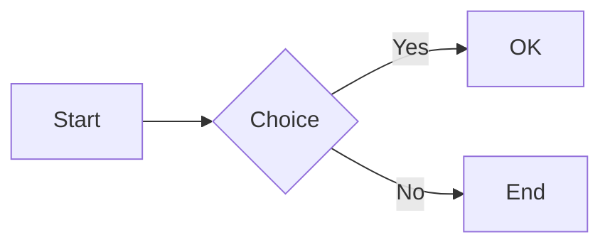
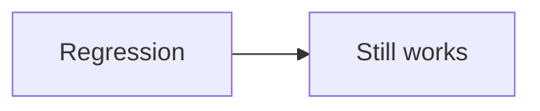

---
page:
  title: "MD++ Preview Test Suite"
  description: "Ручная проверка всех расширений Preview Mode"
style:
  container_max_width: "720px"
access:
  theme: "auto"
safety:
  media_blur: true
---

# MD++ Preview Test Suite

> Откройте этот файл в Notepad, включите **View → Preview Mode**.
> Сверяйте каждую секцию с ожидаемым результатом.
>
> Полный синтаксис: [`MD++-markup.md`](MD++-markup.md).

---

## 1. Базовый GFM [✓ Фаза 0]

### Заголовки

#### H4
##### H5
###### H6

**жирный**, *курсив*, ~~зачёркнутый~~, `inline code`

- Маркированный список
  - Вложенный пункт
  - Ещё один
- Второй пункт

1. Нумерованный
2. Второй
3. Третий

- [x] Выполнено
- [ ] Не выполнено

| Колонка A | Колонка B | Колонка C |
|-----------|-----------|-----------|
| ячейка 1  | ячейка 2  | ячейка 3  |
| left      | center    | right     |

> Обычная цитата с **жирным** текстом.

---

```text
fenced code block
```

Autolinks: https://example.com, www.example.org, user@example.com

Сноска в тексте[^note1] и ещё одна[^note2].

[^note1]: Первая сноска внизу документа.
[^note2]: Вторая сноска с **форматированием**.

---

## 2. Admonitions [✓ Фаза 0]

> [!NOTE]
> Информационная выноска. Поддерживает **жирный** и списки.

> [!TIP]
> Полезный совет.

> [!IMPORTANT]
> Важное сообщение.

> [!WARNING]
> Предупреждение.

> [!CAUTION]
> Осторожно!

---

## 3. Типографика [✓ Фаза 0]

- ==Выделенный текст (mark)==
- ||Скрытый спойлер — кликните, чтобы раскрыть||
- Химическая формула H~2~O (подстрочный индекс: `~2~`)
- Степень x^2^ + y^2^ (надстрочный индекс: `^2^` после буквы)

---

## 4. Mermaid [✓ уже работает]



---

## 5. KaTeX [✓ Фаза 1]

Инлайн: $E = mc^2$ и $\frac{a}{b}$.

Блочная формула:

$$
\int_{0}^{1} x^2 \, dx = \frac{1}{3}
$$

---

## 6. Подсветка кода [✓ Фаза 1]

```python
def greet(name: str) -> None:
    print(f"Hello, {name}!")
```

```cpp
#include <iostream>
int main() {
    std::cout << "Hello\n";
    return 0;
}
```

```json
{"name": "MD++", "version": 1}
```

---

## 7. Frontmatter-эффекты [✓ Фаза 2]

<!-- EXPECTED: #np2-body ~90% ширины preview, data-media-blur=1, KaTeX/hljs post-processed -->
<!-- Диагностика: откройте DevTools WebView2 — не должно быть JSON.parse ошибок -->

Контейнер должен быть уже основной области. При `safety.media_blur: true` картинки ниже размыты до клика.


---

## 8. TOC и Tabs [✓ Фаза 3]

[TOC]

### Подраздел Alpha

Текст alpha.

### Подраздел Beta

Текст beta.

=== "Python"
```python
print("Tab Python")
```

=== "JavaScript"
```javascript
console.log("Tab JS");
```

---

## 9. Медиа и таблицы [✓ Фаза 4]

{64px:64px #left "Подсказка"}

Текст обтекает плавающее изображение слева (если ширина окна позволяет).

| Одна строка | Многострочная |
|-------------|---------------|
| обычная     | строка 1\nстрока 2\nстрока 3 |

YouTube: https://www.youtube.com/watch?v=dQw4w9WgXcQ

---

## 10. Rentry-синтаксис [✓ Фаза 5]

<!-- EXPECTED: .admonition-note с цветной полосой, не сырой [!NOTE] -->
!!! note Заголовок заметки
    Текст выноски в стиле Rentry (HTML admonition с кастомным title).

<!-- EXPECTED: .admonition-info, title «Важно», bold в теле -->
!!! info Важно
    Этот блок — аналог гайда AgentRouter: для **разработчиков** и ролевиков.

<!-- EXPECTED: .admonition-success, список в теле -->
!!! success Что поддерживает мост
    - Текстовый диалог
    - Tool use / Function calling

<!-- EXPECTED: .admonition-warning (регрессия) -->
!!! warning Почему баланс тратится быстро
    Текст предупреждения с **жирным** фрагментом.

<!-- EXPECTED: цветной span.np2-c, не сырой %red% -->
%red% Красный текст %% и %#0066CC% синий hex %%.

<!-- EXPECTED: серый hex (канон %#…) в обычном абзаце -->
%#8e9bb0% Серый текст канонической формой.%%

<!-- EXPECTED: серый hex байпас %RRGGBB% без # внутри — обычный абзац -->
%8e9bb0% Серый текст bare-hex байпасом.%%

<!-- EXPECTED: H1 + серый span; в preview НЕТ видимой сырой # -->
#%8e9bb0% Серый заголовок в стиле AgentRouter гайда.%%

<!-- EXPECTED: красный текст до конца строки (без %%) -->
%red% Красный текст без закрывающих процентов

<!-- EXPECTED: **Установка:** → жирный (fail-handler **text:**) -->
**Установка:**

1. Первый шаг списка после жирного заголовка.

<!-- EXPECTED: *** между блоками → hr, не три звёздочки -->
***

<!-- EXPECTED: цветной жирный по центру, не сырые ** -->
-> %#00ffcc%**Исходный код прокси и обновления:**%% <-

<!-- EXPECTED: text-align center, не сырой -> -->
-> Текст по центру <-

<!-- EXPECTED: text-align right -->
-> Текст по правому краю ->

<!-- EXPECTED: картинка по центру, не сырой  -->
->  <-

<!-- EXPECTED: H1 по центру, без сырой решётки # -->
-> # %#00ffcc%Centered colored H1%% <-

<!-- EXPECTED: H2 по центру (форма из docs rentry: ## -> … <-) -->
## -> Header form from rentry docs <-

<!-- EXPECTED: жирный и ссылка по центру, не сырые ** и […](…) -->
-> **Bold** and [example link](https://example.com) <-

<!-- EXPECTED: .np2-spoiler / .spoiler, клик раскрывает -->
!>Это спойлер Rentry — кликните

---

## 11. Регрессии Preview [ручная проверка]

### 11.1 Zoom (Ctrl + колесо)

<!-- EXPECTED: масштаб меняется при Ctrl+колесо над preview -->
- Наведите курсор на preview, зажмите Ctrl, покрутите колесо.
- Ожидание: текст увеличивается/уменьшается (50–250%, шаг 10%), контент не исчезает.

### 11.2 Resize без полосы

<!-- EXPECTED: нет белой/тёмной полосы 20-30px снизу при быстром ресайзе -->
- Быстро перетащите сплиттер вверх-вниз 5–10 раз.
- Быстро измените размер окна.
- Ожидание: фон preview равномерен, без толстой полосы снизу.

### 11.3 Контент не пропадает при resize

- Прокрутите к §5 (KaTeX), перетащите сплиттер.
- Ожидание: формулы и текст остаются на месте, preview не пустой.

### 11.4 Ширина контента 90%

<!-- EXPECTED: контент занимает ~90% ширины preview pane -->
- Разверните окно на половину экрана или шире.
- Ожидание: текст не зажат в узкую колонку 720px по центру.

### 11.5 Rentry admonition (повтор §10)

<!-- EXPECTED: admonition-note с синей полосой -->
!!! note Тестовая заметка
    Тело выноски с **жирным** текстом.

- Ожидание: цветной блок `.admonition-note`, заголовок и тело внутри блока.

---

## 12. Регрессии уже работающего [✓]

Проверьте, что после правок Rentry **не сломалось** следующее.

### 12.1 GFM admonitions

<!-- EXPECTED: .admonition-note, не сырой [!NOTE] -->
> [!NOTE]
> GFM note body with **bold**.

<!-- EXPECTED: .admonition-warning -->
> [!WARNING]
> GFM warning body.

### 12.2 Typography / spoilers

<!-- EXPECTED: mark, spoiler, rentry spoiler -->
==highlighted== · ||click spoiler|| · !>rentry spoiler line

### 12.3 Plain alignment + named color in paragraph

<!-- EXPECTED: centered plain text; red span in sentence -->
-> Plain centered text without images <-

Ordinary paragraph with %red% red word %% inside.

### 12.4 Image attrs

<!-- EXPECTED: small floated image -->
{64px:64px #left "tip"}

Text should wrap beside the float when the pane is wide enough.

### 12.5 TOC sample

[TOC2]

#### TOC target A
#### TOC target B

### 12.6 Tabs

=== "Reg A"
Tab panel A content.

=== "Reg B"
Tab panel B content.

### 12.7 KaTeX + Mermaid + code

Inline math $E=mc^2$ must render.



```bash
echo "highlight.js still works"
```

---

## Конец теста

Если все секции отображаются как описано — MD++ работает корректно.
